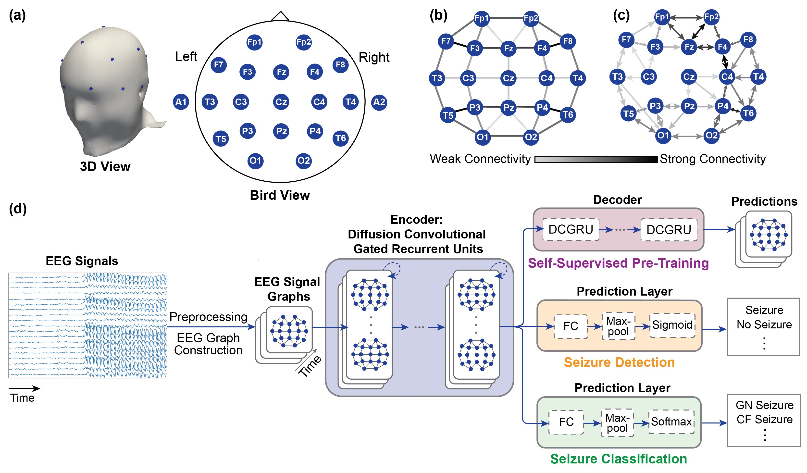

# Self-Supervised Graph Neural Networks for Improved Electroencephalographic Seizure Analysis

Siyi Tang, Jared A. Dunnmon, Khaled Saab, Xuan Zhang, Qianying Huang, Florian Dubost, Daniel L. Rubin, Christopher Lee-Messer. *International Conference on Learning Representations, 2022*. https://openreview.net/pdf?id=k9bx1EfHI_-

---

## Background
Automated seizure detection and classification from electroencephalography (EEG) can greatly improve seizure diagnosis and treatment. However, several modeling challenges remain unaddressed in prior automated seizure detection and classification studies: (1) representing non-Euclidean data structure in EEGs, (2) accurately classifying rare seizure types, and (3) lacking a quantitative interpretability approach to measure model ability to localize seizures. In this study, we address these challenges by (1) representing the **spatiotemporal dependencies** in EEGs using a **graph neural network (GNN)** and proposing two EEG graph
structures that capture the electrode geometry or dynamic brain connectivity, (2) proposing a **self-supervised pre-training** method that predicts preprocessed signals for the next time period to further improve model performance, particularly on rare seizure types, and (3) proposing a quantitative model interpretability approach to assess a model’s ability to localize seizures within EEGs.

<p align="center"></p>

---
## Data

We use the Temple University Seizure Corpus (TUSZ) v1.5.2 in this study. The TUSZ dataset is publicly available [here](https://www.isip.piconepress.com/projects/tuh_eeg/html/downloads.shtml). After you have registered and downloaded the data, you will see a subdirectory called `edf` which contains all the EEG signals and their associated labels. We use the EEG files in the `edf/dev` subfolder as our held-out test set. We further split the EEG files in the `edf/train` subfolder into train and validation sets by patients. See folders `./data/file_markers_detection`, `./data/file_markers_classification`, and `./data/file_markers_ssl` for details.

In this study, we exclude five patients from the test set who exist in both the official TUSZ train and test sets. You can find the list of excluded patients' IDs in `./data_tusz/excluded_test_patients.txt`.

In addition, `./data_tusz/focal_labeled_as_generalized.csv` provides the list of 27 seizures in the test set that we think are **focal seizures** (manually analyzed by a board-certified EEG reader) but are labeled as **generalized non-specific seizures** in TUSZ data. See our paper for more details.

---

## Conda Environment Setup

On terminal, run the following:
```
conda env create -f eeg_gnn.yml
conda activate eeg_gnn
```

---

## Preprocessing
The preprocessing step resamples all EEG signals to 200Hz, and saves the resampled signals in 19 EEG channels as `h5` files.

On terminal, run the following:
```
python ./data/resample_signals.py --raw_edf_dir <tusz-data-dir> --save_dir <resampled-dir>
```
where `<tusz-data-dir>` is the directory where the downloaded TUSZ v1.5.2 data are located, and `<resampled-dir>` is the directory where the resampled signals will be saved.

#### Optional Preprocessing
Note that the remaining preprocessing step in our paper --- Fourier transform on short sliding windows, is handled by dataloaders. You can (optionally) perform this preprocessing step prior to model training to accelerate the training.

Preprocessing for seizure detection and self-supervised pre-training:
```
python ./data/preprocess_detection.py --resampled_dir <resampled-dir> --raw_data_dir <tusz-data-dir> --output_dir <preproc-dir> --clip_len <clip-len> --time_step_size 1 --is_fft
```
where `<clip-len>` is 60 or 12.

Preprocessing for seizure classification:
```
python ./data/preprocess_classification.py --resampled_dir <resampled-dir> --raw_data_dir <tusz-data-dir> --output_dir <preproc-dir> --clip_len <clip-len> --time_step_size 1 --is_fft
```

---

## EEG Graph Visualization

For distance-based EEG graph, we provide the pre-computed adjacency matrix in `./data/electrode_graph`. For correlation-based EEG graphs, adjacency matrices can be obtained from the respective dataloaders in `./data`.

We also provide helper functions in `./graph_viz/graph_viz_utils.py` to visualize the EEG graphs. See notebook `./graph_viz/eeg_graph_visualization.ipynb` for examples of graph visualization.

---
## Experiments

### Seizure Detection
To train seizure detection from scratch using **distance-based EEG graph**, run: 
```
python train.py --input_dir <resampled-dir> --raw_data_dir <tusz-data-dir> --save_dir <save-dir> --graph_type combined --max_seq_len <clip-len> --do_train --num_epochs 100 --task detection --metric_name auroc --use_fft --lr_init 1e-4 --num_rnn_layers 2 --rnn_units 64 --max_diffusion_step 2 --num_classes 1 --data_augment
```
where `<clip-len>` is 60 or 12.

To use **correlation-based EEG graph**, specify `--graph_type individual`.

To use preprocessed Fourier transformed inputs from the above optional preprocessing step, specify `--preproc_dir <preproc-dir>`.


### Seizure Type Classification
To train seizure type classification from scratch using **distance-based EEG graph**, run: 
```
python train.py --input_dir <resampled-dir> --raw_data_dir <tusz-data-dir> --save_dir <save-dir> --graph_type combined --max_seq_len <clip-len> --do_train --num_epochs 60 --task classification --metric_name F1 --use_fft --lr_init 3e-4 --num_rnn_layers 2 --rnn_units 64 --max_diffusion_step 2 --num_classes 4 --data_augment --dropout 0.5
```
Similarly, `<clip-len>` is 60 or 12. To use **correlation-based EEG graph**, specify `--graph_type individual`. To use preprocessed Fourier transformed inputs from the above optional preprocessing step, specify `--preproc_dir <preproc-dir>`.


### Self-Supervised Pre-Training
To train self-supervised next time period prediction using **distance-based EEG graph**, run: 
```
python train_ssl.py --input_dir <resampled-dir> --raw_data_dir <tusz-data-dir> --save_dir <save-dir> --graph_type combined --max_seq_len <clip-len> --output_seq_len 12 --do_train --num_epochs 350 --task 'SS pre-training' --metric_name loss --use_fft --lr_init 5e-4 --num_rnn_layers 3 --rnn_units 64 --max_diffusion_step 2 --data_augment
```
Similarly, `<clip-len>` is 60 or 12. To use **correlation-based EEG graph**, specify `--graph_type individual`. To use preprocessed Fourier transformed inputs from the above optional preprocessing step, specify `--preproc_dir <preproc-dir>`.


### Fine-Tuning for Seizure Detection & Seizure Type Classification
To fine-tune seizure detection/seizure type classification models from self-supervised pre-training, **add** the following additional arguments:
```
--fine_tune --load_model_path <pretrained-model-checkpoint>
```

In addition, we provide pretrained model checkpoints in the folder `pretrained`.

### Baselines
Example scripts to run baseline models are provided in `baseline_scripts`.

---

## Reference
If you use this codebase, or otherwise find our work valuable, please cite:
```
@inproceedings{
tang2022selfsupervised,
title={Self-Supervised Graph Neural Networks for Improved Electroencephalographic Seizure Analysis},
author={Siyi Tang and Jared Dunnmon and Khaled Kamal Saab and Xuan Zhang and Qianying Huang and Florian Dubost and Daniel Rubin and Christopher Lee-Messer},
booktitle={International Conference on Learning Representations},
year={2022},
url={https://openreview.net/forum?id=k9bx1EfHI_-}
}
```
